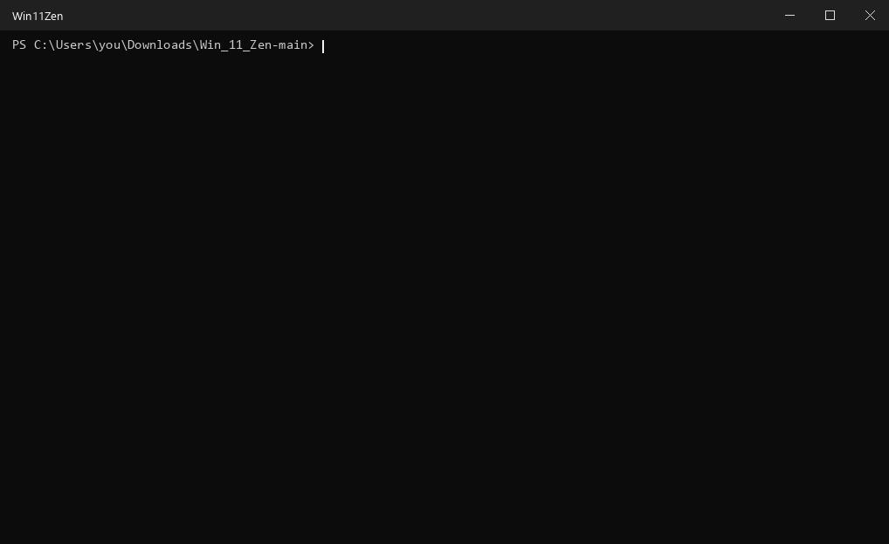

<div align="center">

# Win11Zen

### Debloat Windows 11 without breaking it.

A safe Windows 11 debloat and privacy script. It turns off ads, tips, "suggestions" and tracking toggles,<br>
cleans up the taskbar and Start menu, and can give you a dock-style taskbar with Windhawk.

**No admin rights · No app removal · Backup before every change · One-click undo**

[](LICENSE)
[](#does-it-work-on-my-pc)
[](Win11Zen.ps1)
[](#safety-and-undo)
[](https://github.com/popek1990/Win_11_Zen/releases/latest)
[](https://github.com/popek1990/Win_11_Zen/commits/main)

[Quick start](#quick-start) · [What it changes](#what-it-changes) · [Safety and undo](#safety-and-undo) · [Dock-style taskbar](#optional-dock-style-taskbar-with-windhawk) · [Troubleshooting](#troubleshooting) · [FAQ](#faq)

</div>

<p align="center">
  
  <br>
  <sub>Shown with the optional <a href="#optional-dock-style-taskbar-with-windhawk">Windhawk</a> look. The script itself only flips settings.</sub>
</p>

> ⭐ **If Win11Zen saves you a trip through 11 Settings pages, star the repo.** It helps other people find it.

## Why Win11Zen

Windows 11 spreads ads, tips, "suggestions" and data-sharing toggles across 11 pages of Settings plus File Explorer options, and big updates sometimes switch some of them back on. Heavier debloat tools go after this with admin rights, services, policies and app removal. That reaches further, but it's also where things break and undo gets hard.

Win11Zen takes the careful route. It flips only switches you could flip yourself, only for your own account, and it keeps the old values so undo is exact.

| Win11Zen does | Win11Zen never does |
|---|---|
| Flips up to **31 per-user switches** (24 by default, 7 opt-in), each one also found in Settings or File Explorer options, with [one marked exception](#the-one-exception-silent-app-installs) | Uninstall apps, including Microsoft Store, Edge and WebView2 |
| **Previews first** and changes nothing until you type `Y` | Touch Microsoft Defender, antivirus or the firewall |
| Saves a **backup** and reads it back **before every change** | Disable services or scheduled tasks, edit system files, remove drivers |
| **Undoes exactly**: old values go back, values it added are removed | Pause or block Windows Update |
| Runs a **self-test** on a throwaway registry key before touching yours | Change power, sleep, time zone, clock, languages or keyboard layouts |
| Runs with **normal rights** and refuses to run as administrator | Touch BitLocker, Secure Boot, TPM or BIOS/UEFI |
| **Stops on work or school PCs** (company domain or Microsoft Entra ID) | Use Group Policy, so Home and Pro behave the same |
| Works in **any display language** | Change registry values outside your own user settings (HKEY_CURRENT_USER) |
| Ships with strict rules for **AI agents** ([AGENTS.md](AGENTS.md)) so Claude Code or Codex can walk you through it | Install anything without asking you first |

## Quick start

**You need:** Windows 11 Home or Pro on a personal PC. Nothing to install: it uses the PowerShell that comes with Windows.

1. **[Download the ZIP](https://github.com/popek1990/Win_11_Zen/archive/refs/heads/main.zip)** (or grab the [latest release](https://github.com/popek1990/Win_11_Zen/releases/latest)) and extract it (right-click > **Extract All**). Don't run it from inside the ZIP.
2. Double-click **`Start.cmd`**. If Windows warns that the file came from the internet, choose **Run** (or **More info** > **Run anyway**). Don't use "Run as administrator"; the script refuses to run elevated.
3. It tests itself on a temporary key, lists exactly what will change and asks **once**. Type `Y` and press Enter. Anything else cancels and nothing is changed.
4. At the end it asks whether to install Windhawk for the [dock-style taskbar](#optional-dock-style-taskbar-with-windhawk). `Y` installs it, anything else skips.
5. Sign out and back in so every change shows up.

**Undo at any time:** double-click **`Undo.cmd`** and answer `Y`.

<p align="center">
  
  <br>
  <sub>Real <code>Start.cmd</code> output, recorded on a test registry key so all 24 recommended items show up as changes.</sub>
</p>

Prefer the terminal:

```powershell
git clone https://github.com/popek1990/Win_11_Zen.git
cd Win_11_Zen
.\Start.cmd
```

Just want to look? The preview is read-only and changes nothing:

```powershell
powershell.exe -NoProfile -ExecutionPolicy Bypass -File Win11Zen.ps1
```

`Start.cmd` applies the [recommended set](#what-it-changes). To choose settings one by one, [run it from the terminal](#advanced-run-it-from-the-terminal) or [let an AI agent walk you through it](#let-an-ai-agent-set-it-up).

## What it changes

Every item is a switch for **your user account** that you can also flip yourself in Settings or File Explorer options. The only exception is the opt-in [`silent-app-installs`](#the-one-exception-silent-app-installs). **Default** items are applied by `Start.cmd` and `-Mode Apply`; **opt-in** items only when you name them with `-Only`.

| Category | What goes away | Default | Opt-in |
|---|---|:-:|:-:|
| Ads and promoted content | Personalised ads (advertising ID), suggested content in Settings, OneDrive/Microsoft 365 ads in File Explorer, silent installs of promoted apps | 3 | 1 |
| Tips and nags | "What's new" pages after updates, "finish setting up" reminders, tip pop-ups, "Suggested" notifications, Settings app notifications, lock screen fun facts, feedback requests | 7 | 0 |
| Privacy and data sharing | Language list shared with websites, app-launch tracking, tailored experiences, inking and typing data, clipboard cloud sync, online speech recognition | 5 | 1 |
| Windows search | Cloud (OneDrive/Outlook) results, search highlights, search history | 2 | 1 |
| Start menu | Recommendations, account notifications, recently added apps, recent files, phone panel | 3 | 2 |
| Taskbar, desktop and File Explorer | Hides the search box and Task view button, shows the "This PC" icon and file extensions, plus optional "End task" and open-to-This-PC | 4 | 2 |
| **Total** | | **24** | **7** |

Every row below lists **what you lose**, so you can decide before you apply. Paths use the English interface; in any language, press `Win+R`, paste the `ms-settings:` link (or `control folders` for File Explorer options) and press Enter. The preview with `-Details` also prints where each switch lives and its shortcut.

<details>
<summary><b>Ads and promoted content</b> (3 default, 1 opt-in)</summary>

| ID | Switch (turned **off**) | What you lose | Applied |
|---|---|---|---|
| `advertising-id` | Privacy & security > General > *Let apps show me personalized ads by using my advertising ID* (`ms-settings:privacy-general`) | Nothing noticeable. Ads are less targeted. | Default |
| `settings-suggestions` | Privacy & security > General > *Show me suggested content in the Settings app* | Nothing. | Default |
| `explorer-sync-provider-ads` | File Explorer options > View > *Show sync provider notifications* (`control folders`) | Nothing. OneDrive keeps working; only its promotions in File Explorer go away. | Default |
| `silent-app-installs` | No switch in Settings, [see below](#the-one-exception-silent-app-installs) | Nothing. Apps you install yourself are not affected. | Opt-in |

</details>

<details>
<summary><b>Tips and nags</b> (7 default)</summary>

| ID | Switch (turned **off**) | What you lose | Applied |
|---|---|---|---|
| `welcome-experience` | System > Notifications > Additional settings > *Show the Windows welcome experience...* (`ms-settings:notifications`) | "What's new" pages after updates. | Default |
| `finish-setup-suggestions` | System > Notifications > Additional settings > *Suggest ways to get the most out of Windows...* | Nothing. | Default |
| `tips-and-suggestions` | System > Notifications > Additional settings > *Get tips and suggestions when using Windows* | Pop-up tips. | Default |
| `suggested-notifications` | System > Notifications > *Notifications from apps and other senders* > *Suggested* | Nothing. | Default |
| `settings-app-notifications` | Privacy & security > General > *Show me notifications in the Settings app* (`ms-settings:privacy-general`) | Nothing. | Default |
| `lock-screen-tips` | Personalization > Lock screen > *Get fun facts, tips, tricks, and more on your lock screen* (`ms-settings:lockscreen`) | Nothing. Only matters with a picture or slideshow lock screen. | Default |
| `feedback-frequency` | Privacy & security > Diagnostics & feedback > *Feedback frequency*: Never (`ms-settings:privacy-feedback`) | Nothing. You can still send feedback yourself in the Feedback Hub app. | Default |

</details>

<details>
<summary><b>Privacy and data sharing</b> (5 default, 1 opt-in)</summary>

| ID | Switch (turned **off**) | What you lose | Applied |
|---|---|---|---|
| `website-language-list` | Privacy & security > General > *Let websites show me locally relevant content by accessing my language list* (`ms-settings:privacy-general`) | Some sites may not pick your language automatically. | Default |
| `app-launch-tracking` | Privacy & security > General > *Let Windows improve Start and search results by tracking app launches* | The "Most used" list in Start. | Default |
| `tailored-experiences` | Privacy & security > Diagnostics & feedback > *Tailored experiences* (`ms-settings:privacy-feedback`) | Fewer personalised tips and offers. | Default |
| `inking-typing-improvement` | Privacy & security > Diagnostics & feedback > *Improve inking and typing* | Nothing. Your typing suggestions still work. | Default |
| `clipboard-cloud-sync` | System > Clipboard > *Clipboard across your devices* (`ms-settings:clipboard`) | Copy here, paste on another device. Local clipboard history (`Win+V`) still works. | Default |
| `online-speech-recognition` | Privacy & security > Speech > *Online speech recognition* (`ms-settings:privacy-speech`) | Voice typing (`Win+H`) and other online speech features may stop working. | Opt-in |

</details>

<details>
<summary><b>Windows search</b> (2 default, 1 opt-in)</summary>

| ID | Switch (turned **off**) | What you lose | Applied |
|---|---|---|---|
| `search-cloud-content` | Privacy & security > Search permissions > *Cloud content search* (`ms-settings:search-permissions`) | Search stops showing OneDrive/Outlook account content. Files on the PC are still found. | Default |
| `search-highlights` | Privacy & security > Search permissions > *Show search highlights* | Daily pictures and trending topics in search. | Default |
| `search-history` | Privacy & security > Search permissions > *Search history on this device* | Suggestions based on your earlier searches. | Opt-in |

</details>

<details>
<summary><b>Start menu</b> (3 default, 2 opt-in)</summary>

| ID | Switch (turned **off**) | What you lose | Applied |
|---|---|---|---|
| `start-recommendations` | Personalization > Start > *Show recommendations for tips, shortcuts, new apps, and more* (`ms-settings:personalization-start`) | Nothing. | Default |
| `start-account-notifications` | Personalization > Start > *Show account-related notifications* | Account, backup and subscription reminders in Start. | Default |
| `start-recently-added-apps` | Personalization > Start > *Show recently added apps* | Newly installed apps are no longer highlighted in Start. | Default |
| `start-recent-files` | Personalization > Start > *Show recommended files in Start, recent files in File Explorer, and items in Jump Lists* | Quick access to recently opened files. | Opt-in |
| `start-phone-link` | Personalization > Start > *Show mobile device in Start* | The phone panel next to Start. The Phone Link app still works. | Opt-in |

</details>

<details>
<summary><b>Taskbar, desktop and File Explorer</b> (4 default, 2 opt-in)</summary>

| ID | Switch | What you lose | Applied |
|---|---|---|---|
| `taskbar-search-box` | Personalization > Taskbar > *Search*: Hide (`ms-settings:taskbar`) | Nothing. Press the Windows key and type, or `Win+S`. | Default |
| `taskbar-task-view` | Personalization > Taskbar > *Task view*: off | Nothing. `Win+Tab` still works. | Default |
| `desktop-this-pc-icon` | Personalization > Themes > Desktop icon settings > *Computer*: **on** (`ms-settings:themes`) | Nothing. It adds the real "This PC" icon (no shortcut arrow). | Default |
| `show-file-extensions` | File Explorer options > View > *Hide extensions for known file types*: unticked (`control folders`). **This one is for safety:** you can see that `invoice.pdf.exe` is a program, not a PDF. | File names show their ending (`.pdf`, `.exe`). Keep it when renaming; Windows warns you if you change it. | Default |
| `taskbar-end-task` | System > Advanced (older versions: For developers) > *End task*: **on** (`ms-settings:developers`) | Nothing. Adds "End task" to the right-click menu of taskbar buttons. It closes the app at once, so unsaved work in it is lost. | Opt-in |
| `explorer-open-this-pc` | File Explorer options > General > *Open File Explorer to*: This PC | Recent files are no longer the first thing you, or someone watching your screen, see. They stay one click away under Home. | Opt-in |

</details>

### The one exception: `silent-app-installs`

Windows sometimes installs promoted apps and games on its own. This opt-in setting tells it to stop (`SilentInstalledAppsEnabled = 0` for your user account). Settings has no switch for it, which is why it's the only item that breaks the "only Settings switches" rule. It is still per-user, needs no administrator rights, is backed up and undone like everything else, and is never applied unless you name it with `-Only`.

## Safety and undo

### How the backup works

1. Before writing anything, Win11Zen saves the current value of every switch it's about to change to a JSON file in `%LOCALAPPDATA%\MinimalWindows\backups`, then reads that file back to check it.
2. It writes each value and reads it again to confirm it stuck. Anything that didn't is reported, never silently skipped.
3. **Restore** puts the old values back exactly. Values that didn't exist before are deleted, and keys it created are removed if they're still empty.
4. Restore only ever writes values from the script's own list, even if someone edited a backup file by hand.
5. Every Restore first saves a `pre-restore-*.json` file, so a Restore can be undone too.

Backups hold only the old values of the switches listed above (plain numbers, no personal data). Keep them: without them, Restore has nothing to restore.

### Undo

| What | How |
|---|---|
| Everything the script ever changed, the easy way | Double-click `Undo.cmd` and answer `Y` |
| Only the last Apply | `powershell.exe -NoProfile -ExecutionPolicy Bypass -File Win11Zen.ps1 -Mode Restore` |
| Everything, from the terminal | `powershell.exe -NoProfile -ExecutionPolicy Bypass -File Win11Zen.ps1 -Mode Restore -All` |
| A specific backup, or a Restore | `powershell.exe -NoProfile -ExecutionPolicy Bypass -File Win11Zen.ps1 -Mode Restore -BackupFile "<path to .json>"` |
| Manual steps | Flip the switch back in Settings |
| Windhawk | Turn off the mod, or uninstall Windhawk in Settings > Apps > Installed apps |
| An app you uninstalled yourself | Reinstall it from Microsoft Store or the maker's website |

### What about a System Restore point?

The script doesn't create one: that needs administrator rights, and its own backups already cover everything it changes. If you also plan to do the manual steps or install Windhawk and want an extra safety net, make one yourself: press `Win+R`, type `SystemPropertiesProtection`, and click **Create** (System Protection must be on for drive C:).

### Honest limits

- This is **not "zero telemetry"**. Windows still sends the required diagnostic data. Only the Enterprise and Education editions can go lower, and this project doesn't pretend otherwise.
- Settings has no switch that removes **web results from Start search** on home PCs. This project doesn't use unsupported hacks for it.
- Big Windows updates sometimes switch suggestions back on. Run the preview again after an update ([details below](#after-big-windows-updates)).
- Windhawk is third-party software. It's optional and covered in [its own section](#optional-dock-style-taskbar-with-windhawk).

Win11Zen is provided as-is under the [MIT License](LICENSE), without warranty. Read the preview before you apply.

## Does it work on my PC?

| Your PC | Supported? |
|---|---|
| Windows 11 Home or Pro, personal computer | Yes |
| Windows 11 in S mode | Only the manual steps. S mode blocks PowerShell scripts. |
| Work or school computer (company domain or Microsoft Entra ID) | No. The script stops. Ask your IT department. |
| Windows 10 (any build below 22000) | No. The script stops. |
| Windows Server | No. The script stops. |

To check your version, press `Win+R`, type `winver` and press Enter.

## Advanced: run it from the terminal

Open the extracted folder, right-click an empty area and choose **Open in Terminal**. It opens with normal rights; don't use "Run as administrator".

| What | Command |
|---|---|
| Test that it works on this PC (temporary test key only) | `powershell.exe -NoProfile -ExecutionPolicy Bypass -File Win11Zen.ps1 -Mode SelfTest` |
| **Preview** (changes nothing) | `powershell.exe -NoProfile -ExecutionPolicy Bypass -File Win11Zen.ps1` |
| Preview, plus where each switch is in Settings | `powershell.exe -NoProfile -ExecutionPolicy Bypass -File Win11Zen.ps1 -Details` |
| Preview only the settings you picked | `powershell.exe -NoProfile -ExecutionPolicy Bypass -File Win11Zen.ps1 -Only "advertising-id,search-history"` |
| Apply the recommended settings | `powershell.exe -NoProfile -ExecutionPolicy Bypass -File Win11Zen.ps1 -Mode Apply` |
| Apply recommended plus chosen opt-in ones | `powershell.exe -NoProfile -ExecutionPolicy Bypass -File Win11Zen.ps1 -Mode Apply -Only "recommended,start-recent-files,taskbar-end-task"` |
| Apply only specific settings | `powershell.exe -NoProfile -ExecutionPolicy Bypass -File Win11Zen.ps1 -Mode Apply -Only "advertising-id,tips-and-suggestions"` |
| Apply everything, including all opt-in items | `powershell.exe -NoProfile -ExecutionPolicy Bypass -File Win11Zen.ps1 -Mode Apply -Only "all"` |
| Undo the last Apply | `powershell.exe -NoProfile -ExecutionPolicy Bypass -File Win11Zen.ps1 -Mode Restore` |
| Undo everything this script has ever changed | `powershell.exe -NoProfile -ExecutionPolicy Bypass -File Win11Zen.ps1 -Mode Restore -All` |

<details>
<summary><b>Privacy only: the recommended set without the look changes</b></summary>

The recommended set also changes the look: it hides the taskbar search box and the Task view button and shows the "This PC" desktop icon. To leave your taskbar and desktop alone, apply the other 21 recommended items:

```powershell
powershell.exe -NoProfile -ExecutionPolicy Bypass -File Win11Zen.ps1 -Mode Apply -Only "advertising-id,website-language-list,app-launch-tracking,settings-suggestions,tailored-experiences,inking-typing-improvement,search-cloud-content,search-highlights,start-recommendations,start-account-notifications,welcome-experience,finish-setup-suggestions,tips-and-suggestions,lock-screen-tips,clipboard-cloud-sync,settings-app-notifications,suggested-notifications,feedback-frequency,explorer-sync-provider-ads,start-recently-added-apps,show-file-extensions"
```

</details>

When it finishes, the script prints what it changed now, what was already set, anything it skipped and why, where the backup is and how to undo it. After applying, **sign out and back in** (or restart).

`-ExecutionPolicy Bypass` applies only to that single PowerShell run. It does not change your PC's script settings.

Exit codes: `0` done, `1` stopped before changing anything, `2` finished but some settings were not changed (the output says which).

## Let an AI agent set it up

Win11Zen ships with [AGENTS.md](AGENTS.md), a strict rulebook for Claude Code, Codex and other coding agents.

1. Download and extract this repository (or `git clone` it).
2. Open the folder, right-click an empty area and choose **Open in Terminal**.
3. Start `claude` or `codex` and type:

   ```text
   Read AGENTS.md and help me set up this project on my PC.
   ```

The agent runs the self-test, explains the preview in plain words (in your language) and asks what you want. It then applies only that and tells you how to undo it. It never uses administrator rights, never goes beyond the script, and won't install anything for you.

## Optional: dock-style taskbar with Windhawk

> **Read this first.** This is the only part of the project that isn't built into Windows. [Windhawk](https://windhawk.net/) is free, open-source third-party software that loads small "mods" into the taskbar and Start menu. It's popular and fully reversible, but not zero-risk: after a big Windows update a mod can look wrong or stop working until its author updates it. Skip this part on work PCs, in S mode, or if you'd rather not deal with that.

**Install:** answer `Y` to the Windhawk question at the end of `Start.cmd`. It installs the official package with winget, which checks the installer's checksum, and opens Windhawk. Or install it yourself with `winget install --id RamenSoftware.Windhawk --exact`, or download it only from [windhawk.net](https://windhawk.net/) (source on [GitHub](https://github.com/ramensoftware/windhawk)). Either way, Windows asks for administrator approval because an app is being installed.

**Then pick the mods (about two minutes).** In Windhawk, open **Explore**, search for each mod, click **Install**, open its **Settings** tab, choose the option and click **Save**. Windhawk has no official way to install or configure mods from a script, and faking one would mean editing its internal settings with admin rights, so this part stays manual on purpose.

| Mod | Setting | Result |
|---|---|---|
| [Windows 11 Taskbar Styler](https://windhawk.net/mods/windows-11-taskbar-styler) | Theme: `DockLike` | Centred, floating, dock-style taskbar |
| [Windows 11 Start Menu Styler](https://windhawk.net/mods/windows-11-start-menu-styler) | Theme: `Fluent2Inspired` (recommended) | Rounded, translucent, clean Start menu that keeps your pinned apps. Works with both the redesigned Start menu (Windows 11 25H2) and the older one. |
| [Taskbar tray system icon tweaks](https://windhawk.net/mods/taskbar-tray-system-icon-tweaks) | *Hide language bar*: on | Hides the language indicator (e.g. "ENG") next to the clock. Only useful with more than one keyboard layout; `Win+Space` still switches layouts. |

<details>
<summary><b>Which Start theme? And tips for a clean Start menu</b></summary>

- **`Fluent2Inspired`** is the recommended one and was tested with this project. It works with both the redesigned Start menu (Windows 11 25H2) and the older one, in dark and light mode. It uses the Aptos font where available (installed with Microsoft 365); otherwise Windows shows its standard font.
- **`Fluid`** is only for the redesigned Start menu and is made for dark mode (its guide has one extra line for light mode).
- **`OnlySearch`** suits people who only ever type to search.

Theme guides: [DockLike](https://github.com/ramensoftware/windows-11-taskbar-styling-guide/blob/main/Themes/DockLike/README.md), [Fluent2Inspired](https://github.com/ramensoftware/windows-11-start-menu-styling-guide/blob/main/Themes/Fluent2Inspired/README.md), [Fluid](https://github.com/ramensoftware/windows-11-start-menu-styling-guide/blob/main/Themes/Fluid/README.md), [OnlySearch](https://github.com/ramensoftware/windows-11-start-menu-styling-guide/blob/main/Themes/OnlySearch/README.md).

If a theme looks broken on your Windows version, try another one or set it to *None*. If nothing changes after saving, sign out and back in. Start themes only change the look; they don't block web search or telemetry.

**Good companions for a clean Start menu** (Settings > Personalization > Start; the first two are in the script's recommended set): turn off *Show recently added apps* and *Show recommendations for tips, shortcuts, new apps, and more*. Optionally also turn off *Show recommended files...* (`start-recent-files`); this also removes recent files from File Explorer and Jump Lists. Pinned apps always fill the grid in order with no empty spaces; that's a Windows limitation no mod changes. You can still reorder them by dragging, or drop one icon onto another to make a folder.

</details>

**If something goes wrong:**

1. Press `Ctrl+Shift+Esc` to open Task Manager. It works even if the taskbar is broken.
2. Click **Run new task**, type `C:\Program Files\Windhawk\windhawk.exe` and press Enter. Turn off the mod you changed last.
3. Or remove Windhawk completely: **Run new task**, then `appwiz.cpl`, then uninstall **Windhawk**.
4. Sign out and back in (`Ctrl+Alt+Del`, then **Sign out**). Windows is back to normal.

Never turn off your antivirus to "fix" a mod.

## Manual steps (optional)

The script doesn't do these. Some affect every user of the PC, Windows protects some from scripts, and some are personal choices. Open each page with `Win+R` and the `ms-settings:` link.

<details>
<summary><b>13 more things worth doing by hand</b> (diagnostic data, Widgets, startup apps, safe app removal, Recall and more)</summary>

1. **Optional diagnostic data**: `ms-settings:privacy-feedback`. Turn off *Send optional diagnostic data*. This affects all users of the PC.
2. **Widgets**: `ms-settings:taskbar`. Turn off *Widgets*. Recent Windows versions block scripts from changing this switch.
3. **Lock screen**: `ms-settings:lockscreen`. Choose *Picture* instead of *Windows spotlight* if you don't want rotating Microsoft content.
4. **Startup apps**: `ms-settings:startupapps`. Turn off apps you don't need right after sign-in; you can still open them yourself. **Leave on:** antivirus and security software, manufacturer tools for keys, touchpad, audio or battery, remote-access or backup tools you rely on.
5. **Uninstall apps you never use**: `ms-settings:appsfeatures`. Only remove apps you recognise; if unsure, leave the app. **Never remove:**
   - antivirus or security software
   - Microsoft Store and Microsoft Edge
   - Microsoft Edge WebView2 Runtime, Microsoft Visual C++ Redistributable, .NET
   - Xbox TCUI and Xbox Identity Provider (Microsoft Store, Photos and games use them)
   - Get Help (Windows troubleshooters use it)
   - drivers and manufacturer utilities (Intel, AMD, NVIDIA, Realtek, Lenovo, Dell, HP, Acer, ASUS...). These often control keys, fans or the battery charge limit.
   - anything named *Runtime*, *Framework* or *Driver*
6. **Taskbar pins**: open an app, right-click its taskbar icon and choose **Pin to taskbar**. To remove one, right-click it and choose **Unpin from taskbar**.
7. **App permissions**: `ms-settings:privacy-location`, `ms-settings:privacy-webcam`, `ms-settings:privacy-microphone`. Allow only the apps that need them. Keep location on if you use *Set time zone automatically* or *Find my device*.
8. **Recall** (only on Copilot+ PCs): Privacy & security > Recall & snapshots. Decide whether you want it.
9. **Your browser**: review its own privacy settings (tracking protection, third-party cookies). This project doesn't change browsers.
10. **Sharing updates with other PCs**: `ms-settings:delivery-optimization`. Turn off *Allow downloads from other PCs*. Updates still come from Microsoft as usual; your PC just stops uploading them to other computers over your connection.
11. **AI features in Notepad and Paint**: open the app, go to its settings (gear icon) and turn off Copilot/AI features if your version has that option.
12. **Wallpaper**: `ms-settings:personalization-background`.
13. **An extra keyboard layout**, for example Polish (Programmers): `ms-settings:regionlanguage`, then your language, then **Language options** and **Add a keyboard**. Adding a layout doesn't remove anything. Don't remove languages or layouts unless you're sure you don't need them.

**Time zone and clock:** this project doesn't change them. If your clock is wrong, open `ms-settings:dateandtime` and turn on *Set time zone automatically* (needs location), or pick your time zone manually.

</details>

## After big Windows updates

Run the preview again. If some items show `TO DO` again, Windows switched them back on. Apply again, and a new backup is made.

## Troubleshooting

| You see | What to do |
|---|---|
| A warning that `Start.cmd` came from the internet | Normal for downloaded files. Choose **Run** (or **More info** > **Run anyway**). |
| `STOPPED` ... `PowerShell is running as administrator` | Open a normal terminal (not "Run as administrator"), or just double-click `Start.cmd`. |
| `STOPPED` ... `joined to a company domain` or `work or school organisation` | By design: settings on managed PCs belong to your IT department. |
| `STOPPED` ... `Windows 11 is required` or `not Windows Server` | Only Windows 11 for PCs is supported. |
| `Guided mode needs a window where you can type` | Double-click `Start.cmd` yourself, or use `-Mode Preview` and `-Mode Apply` from a script. |
| `FAILED - do not use -Mode Apply on this PC` (self-test) | Don't apply. Please [open an issue](https://github.com/popek1990/Win_11_Zen/issues) with the full output. |
| `SKIP` next to a setting | An existing value has an unexpected type, so it's left alone on purpose. |
| Nothing looks different after applying | Sign out and back in (or restart). |
| winget is not available | Download Windhawk yourself from [windhawk.net](https://windhawk.net/), or skip it. |

## FAQ

<details>
<summary><b>Is it safe? Can I read what it does first?</b></summary>

Yes, and you should. Every setting is in one plain-text list (`$Catalog`) at the top of [Win11Zen.ps1](Win11Zen.ps1). The script writes only to your own user settings (HKEY_CURRENT_USER), only the values in that list, and each one lists what you lose. It backs up before changing anything, checks every write and can undo exactly. The default mode is a read-only preview.

</details>

<details>
<summary><b>Why does it refuse to run as administrator?</b></summary>

It doesn't need admin rights, and running without them is a safety feature: without them it cannot change Windows itself or other accounts, even by mistake. The only step that asks for admin approval is the optional Windhawk installer, and that prompt comes from Windows, not from the script.

</details>

<details>
<summary><b>Will it make my PC faster?</b></summary>

Not noticeably. The goal is less noise and less data sharing, not speed.

</details>

<details>
<summary><b>Why not disable telemetry services or scheduled tasks?</b></summary>

It can break Windows Update, diagnostics and troubleshooting. Home editions ignore many of the related policies, and Windows may undo it anyway. It doesn't fit this project's "nothing can break" rule.

</details>

<details>
<summary><b>Does it remove Copilot, Edge, OneDrive or other apps?</b></summary>

No. Win11Zen never uninstalls anything. It hides OneDrive and Microsoft 365 promotions in File Explorer and turns off OneDrive/Outlook results in search, but OneDrive itself keeps working. If you want to remove apps you never use, the [manual steps](#manual-steps-optional) include a list of what you should never remove. Recall and the AI features in Notepad and Paint are covered there too.

</details>

<details>
<summary><b>Will Windows updates undo it?</b></summary>

Sometimes. Big updates can switch suggestions back on. Run the preview again: anything that shows `TO DO` was switched back. Apply again and a new backup is made.

</details>

<details>
<summary><b>Can I choose only some settings?</b></summary>

Yes. Pass the IDs you want with `-Only` (see [Advanced](#advanced-run-it-from-the-terminal)), or [let an AI agent](#let-an-ai-agent-set-it-up) explain each one and apply only what you agree to. `recommended` and `all` also work as IDs.

</details>

<details>
<summary><b>Home vs Pro?</b></summary>

Same switches, same result. The project doesn't use Group Policy, which Home doesn't have.

</details>

<details>
<summary><b>Why is the backup folder called <code>MinimalWindows</code>?</b></summary>

That was the project's internal name before it became Win11Zen. The script keeps the old folder and name so existing backups keep working with Restore.

</details>

<details>
<summary><b>How is this different from Win11Debloat?</b></summary>

[Win11Debloat](https://github.com/Raphire/Win11Debloat) is a popular, well-made tool that goes much further. It uses administrator rights and system-wide policies, removes many apps for all users, and also changes Windows Update, power and security-related settings. This project deliberately stays smaller: only your user account, no administrator rights, and an exact undo. Several items here were cross-checked against Win11Debloat's registry files.

</details>

## Contributing

Issues and pull requests are welcome. The most useful ones:

- **A switch moved, was renamed or stopped working** after a Windows update. Open an issue with the preview output; its first lines show your Windows edition, version and build.
- **The self-test failed** on your PC. Include the full `-Mode SelfTest` output.
- **A new setting.** It has to fit the project's rules: per-user (HKEY_CURRENT_USER), a switch that also exists in Settings or File Explorer options, and no administrator rights. Add it to `$Catalog` in [Win11Zen.ps1](Win11Zen.ps1) with its `Where`, `Page` and `Note`, then run `-Mode SelfTest` before opening the pull request.

Out of scope on purpose: services, scheduled tasks, Group Policy, app removal, and anything that needs administrator rights.

## Credits

- [Windhawk](https://windhawk.net/) by Ramen Software, and the authors of the Taskbar Styler, Start Menu Styler and tray icon mods.
- [Win11Debloat](https://github.com/Raphire/Win11Debloat), used to cross-check several registry values.

## License

[MIT](LICENSE) © 2026 popek1990.eth

<div align="center">

⭐ **If Win11Zen made Windows 11 quieter for you, star the repo** and share it with the friend who always asks you to fix their laptop.

</div>
